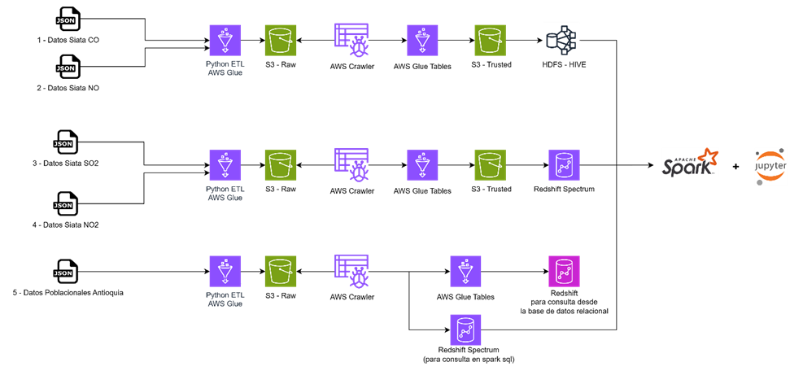

# st1800-241-trabajo1
Trabajo 1 de la materia Almacenamiento y Recuperacion de Información - Universidad EAFIT

Se plantea determinar tendencias en el comportamiento del calentamiento global enfocado al Valle de Aburra; hecho por el cual se implementan las bases de datos del SIATA y Gov. A continuación, se describen las etapas para el desarrollo según los elementos del trabajo.

## Fuentes de datos:
•[SIATA - Monóxido de Carbono (CO)](https://datosabiertos.metropol.gov.co/sites/default/files/uploaded_resources/Datos_SIATA_Aire_co.json)
•[SIATA - Óxido Nítrico (NO)](datosabiertos.metropol.gov.co/sites/default/files/uploaded_resources/Datos_SIATA_Aire_no.json)
•[SIATA - Dióxido de Azufre (SO2)](datosabiertos.metropol.gov.co/sites/default/files/uploaded_resources/Datos_SIATA_Aire_so2.json)
•[Dióxido de Nitrógeno (NO2)](datosabiertos.metropol.gov.co/sites/default/files/uploaded_resources/Datos_SIATA_Aire_so2.json)
•[Datos Gov CO](https://www.datos.gov.co/resource/evm3-92yw.json)


## Ingesta de datos:
La ingesta de los datos se realiza a través de las APIs por medio de Python donde se emplea la librería boto3, con la cual se le apunto directamente al Bucket en el servicio S3 de AWS.

## Arquitectura y Componentes para la Solución



AWS Glue: Para la realización de ETLs desde los Endpoints origen de los datos hacia S3 en zona RAW. Adicionalmente para llevar de zona RAW a zona Trusted la información almacenándola en formato parquet para que el tamaño de la información sea óptimo
1.	S3: almacenando en un Bucket la información en la zona RAW y así mismo hacia la zona TRUSTED ya con la información lista para utilizarse por los otros sistemas
•	Raw: s3://eiglesiasrtrabajo1/raw/
•	Trusted: s3://eiglesiasrtrabajo1/trusted/

2.	AWS Crawler: Identificación de Tablas y campos en la zona RAW

3.	HDFS Hive: consultas sobre tablas externas creadas en HIVE para ser consultadas desde HIVE y desde el notebook con spark sql.

4.	Redshift Spectrum: creación de tablas creadas en Redshift Spectrum apuntando a zona TRUSTED las cuales pueden ser consultadas desde HIVE y desde el notebook con park sql.

5.	Redshift: Almacenamiento en base de datos relacional para fines de BI, actualmente ser hará una catalogación adicional para exponerla también desde S3 y ser utilizada desde spark sql.

6.	Spark/Jupyter: Creación de Notebook para explorar los datos desde las diversas fuentes y generar insigths.


### Estructura del Repositorio
```
st1800-241-trabajo1
│   README.md                           # Descripcion
|   diagrama1.png                       # Diagrama de Arquitectura
│   
└───1 AWS Glue Raw Python ETL           # ETLs AWS GLUE hacia zona RAW
|   | ETL Poblacion Antioquia.py        # ETL informacion poblacional Data Gov
|   | ETL_dioxidos.py                   # ETL data del Siata  
|   | ETL_monoxidos.py                  # ETL data del Siata
|   |
└───2 AWS Glue Trusted Visual ETL       # ETLs AWS GLUE hacia zona Trusted
|   | Glue Trusted ETL CO.py            # ETL informacion poblacional Data Gov
|   | Glue Trusted ETL NO.py            # ETL informacion poblacional Data Gov
|   | Glue Trusted ETL NO2.py           # ETL informacion poblacional Data Gov
|   | Glue Trusted ETL SO2.py           # ETL informacion poblacional Data Gov
|   |
└───3 Redshift Creacion y ETL           # Creacion de tabla Nativa en Redshift y ETL
|   | redshift.sql                      # ETL informacion poblacional Data Gov
|   |
└───4 Consultas SQL                     # Ej Consultas en HIVE, RedshiftSpectrum
|   | 1 Redshift Spectrum.sql           # Consulta Redshift Spectrum
|   | 2 Hive.sql                        # Consulta Hive
|   | 3 Athena.sql                      # Athena
|   |
└───5 Notebook                          # Notebook pySpark EMR
|   | Trabajo1_Exploracion_Datos.ipynb  # Notebook
```
